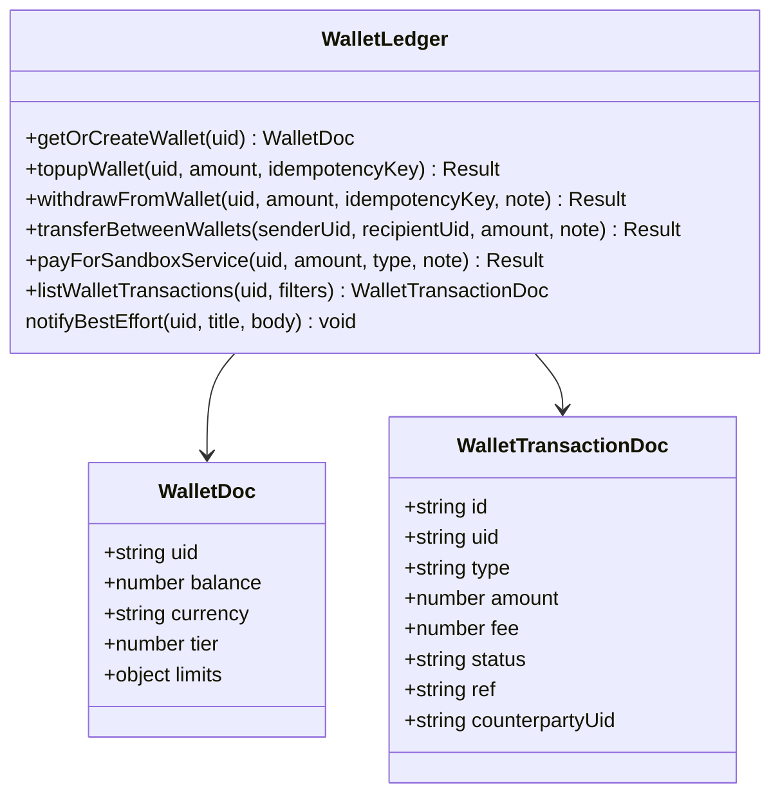

# System Design — GhanaPay Mobile

Complements `docs/05_Architecture.md` (which covers high-level structure
and diagrams). This document covers design decisions, patterns, and
module-level design actually used in the codebase.

## 1. Layered design

```
Presentation Layer      React Client Components (src/app/**/page.tsx)
API Layer                Next.js Route Handlers (src/app/api/**/route.ts)
Business Logic Layer     src/lib/*.ts (wallet-ledger, kyc-record, etc.)
Data Access Layer        Firebase Admin SDK (server) / Client SDK (client, auth+storage only)
```

Each layer only calls the layer directly below it. Notably: **API routes
never contain business logic directly** — they call into `src/lib/*.ts`
functions, which is what makes those functions independently testable
(see `docs/09_Testing_Report.md` for the pure-logic extraction pattern
this enabled).

## 2. Key design patterns used

### Server-authoritative writes
Every financial/privileged write happens server-side via the Admin SDK,
never trusting a client-computed value. Applied consistently to wallet
balance, KYC status, notification creation, admin user actions.

### Atomic transactions for money movement
`db.runTransaction()` wraps every balance-changing operation
(`wallet-ledger.ts`). A transfer's sender-debit and recipient-credit
happen in one atomic unit — verified by design (Firestore transactions
either fully commit or fully roll back), though not yet verified by a
live integration test (see `docs/22_Risk_Register.md` R-01).

### Idempotency keys
Client-supplied idempotency keys are checked inside the same atomic
transaction as the write, preventing a double-submitted request (e.g., a
user double-tapping "top up") from applying twice.

### Sandbox provider abstraction
Rather than faking a real payment gateway response, every simulated
external interaction (top-up funding source, bill payment, airtime
delivery, linked account verification) is implemented as an explicitly
labeled sandbox function — `payForSandboxService()` and similar — so a
real provider could be substituted later without restructuring the wallet
core.

### Pure logic / I/O separation
Introduced specifically to enable automated testing (Phase 15):
`statements.ts` and `scheduled-payments.ts` originally mixed Firestore
calls with computation in the same function, which is untestable without
mocking the Admin SDK. Both were split into a pure computation module
(`statements-core.ts`, `schedule-dates.ts` — zero Firebase imports) and a
thin I/O wrapper. This is now the standard pattern for any new
computation-heavy feature.

### Single source of truth for aggregates
Adopted after a real bug (Defect Log DEF-006): any summary/dashboard view
queries the same underlying collections the detail pages query, rather
than maintaining a separately-computed number that can drift out of sync.

## 3. Module design — wallet ledger (representative example)



Design note: `notifyBestEffort()` is deliberately called **after** the
Firestore transaction commits, not from inside the transaction callback —
Firestore retries transaction callbacks on write contention, and calling
a side effect (notification creation) from inside one risks duplicate
notifications for a single logical operation. This is documented directly
in the source code comments as a design decision, not an oversight.

## 4. Interface design (screen-to-module mapping)

| Screen | Primary lib module(s) | API routes |
|---|---|---|
| Wallet | `wallet-ledger.ts`, `linked-accounts.ts` | `/api/wallet*` |
| Send Money | `wallet-ledger.ts`, `server-user-lookup.ts`, `phone.ts` | `/api/transactions/transfers`, `/api/user/lookup` |
| KYC | `kyc-record.ts`, `kyc-upload.ts` | `/api/kyc/*` |
| Admin KYC Queue | `kyc-record.ts` | `/api/kyc?admin=true`, `PATCH /api/kyc` |
| Admin Overview | `admin-overview.ts` | `/api/admin/overview` |
| Statements | `statements.ts`, `statements-core.ts` | `/api/statements` |
| Analytics | `analytics.ts` | `/api/analytics/*` |
| Scheduled Payments | `scheduled-payments.ts`, `schedule-dates.ts` | `/api/scheduled*` |

## 5. Design decisions explicitly reconsidered

- **"Transfer" on the wallet page vs. peer-to-peer send-money**: initially
  risked being conflated as the same feature. Design decision: the wallet
  page's "Transfer to linked account" is implemented as
  bookkeeping-equivalent to a withdrawal (there's no real second wallet or
  bank account to credit), explicitly documented as such in code, and
  kept separate from the real peer-to-peer transfer at
  `/api/transactions/transfers`.
- **Admin route protection**: initially only client-side
  (`AdminProtectedRoute`), later explicitly documented as a UX convenience
  only — the real boundary is `requireAuth()` server-side on every route,
  confirmed by a full audit in Phase 16.
