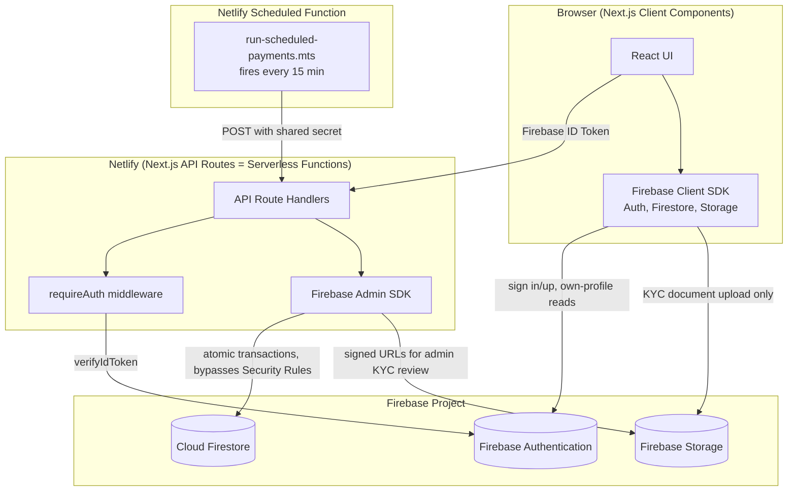
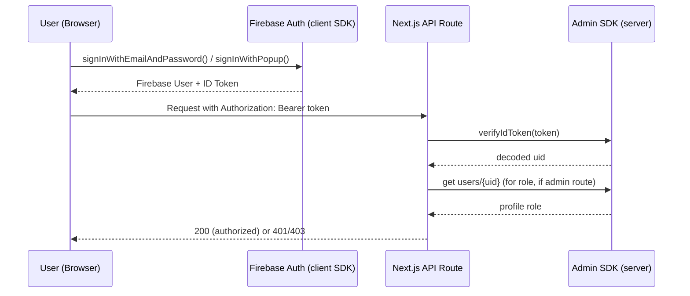
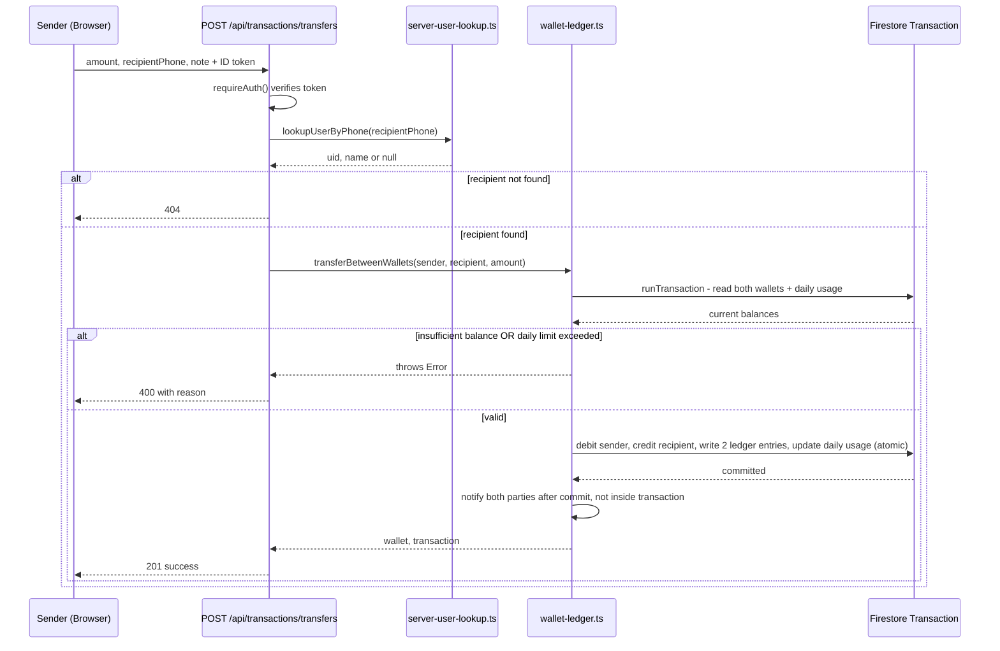
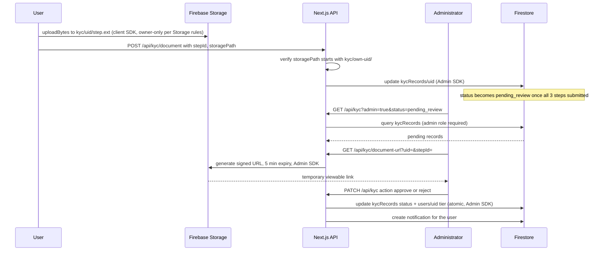
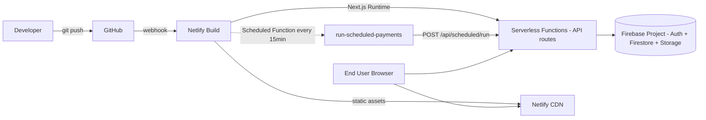

# System Architecture — GhanaPay Mobile

## 1. High-level architecture

**Key architectural decision**: the client Firebase SDK is used for
authentication and KYC document upload only. Every financial write
(wallet balance, transfers, KYC approval, admin actions) goes through a
Next.js API route using the Admin SDK — the client never has direct
Firestore write access to anything that matters. This is enforced both
architecturally (the client SDK simply isn't used for these writes) and
defensively (Firestore Security Rules deny client writes to those
collections even if someone tried).

## 2. Authentication flow

## 3. Wallet transfer sequence (atomic, server-side)

## 4. KYC review workflow

## 5. Deployment architecture

## 6. Component/module map (real files, not aspirational)

| Layer | Files | Responsibility |
|---|---|---|
| Client Firebase config | `src/lib/firebase.ts` | Client SDK init, hardcoded working defaults + env override |
| Server Firebase config | `src/lib/firebase-admin.ts` | Admin SDK init from service-account env vars, server-only |
| Auth middleware | `src/lib/server-auth.ts` | `requireAuth()` — the single enforcement point for every protected route |
| Wallet core | `src/lib/wallet-ledger.ts` | Atomic top-up/withdraw/transfer/bill/airtime logic |
| KYC core | `src/lib/kyc-record.ts`, `src/lib/kyc-upload.ts` | Document submission, review, storage path handling |
| Scheduled payments | `src/lib/scheduled-payments.ts`, `src/lib/schedule-dates.ts` | CRUD + execution engine + pure date math |
| Statements | `src/lib/statements.ts`, `src/lib/statements-core.ts` | Firestore I/O vs. pure running-balance computation, split for testability |
| Notifications | `src/lib/notifications.ts` | Server-created in-app notifications |
| Admin aggregation | `src/lib/admin-overview.ts`, `admin-users.ts`, `admin-transactions.ts` | Dashboard stats derived from the same collections the detail pages query |
| Phone utilities | `src/lib/phone.ts` | Ghanaian phone normalization, used both client and server side |

## 7. Data flow principle: single source of truth

A recurring pattern across this codebase, adopted after a real
dashboard/detail-page mismatch bug found during development (see
`docs/PROJECT_AUDIT.md` Phase 12): any summary or aggregate view (the
admin overview dashboard, the sidebar's KYC badge count) queries the
**same underlying Firestore collections** the detail pages query, rather
than maintaining a separately-computed number. This makes the class of
bug where a summary count silently drifts from what you see on the detail
page structurally impossible, rather than something to remember to keep
in sync by hand.
