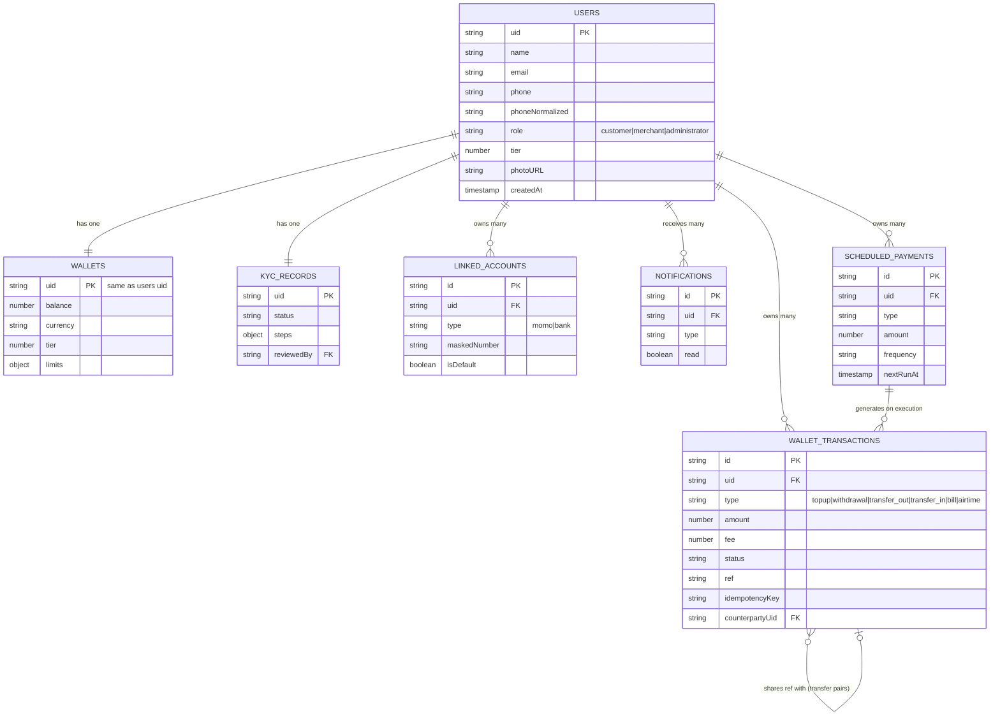

# Database Design — GhanaPay Mobile

Firestore is a NoSQL document database — there are no foreign keys or
joins. Relationships below are logical (a field on one document
referencing another document's ID), enforced by application code and
Security Rules, not by the database engine itself.

## 1. Entity-relationship diagram (logical)

## 2. Collections — purpose, fields, access pattern

### `users/{uid}`
**Purpose**: profile + role. Document ID is the Firebase Auth UID.
**Key fields**: `name`, `email`, `phone`, `phoneNormalized` (for recipient
lookup), `role`, `tier`, `photoURL`.
**Access pattern**: read by owner or admin; created once on first sign-in
(`src/lib/user-profile.ts`); `role`/`tier` can never be set by a client
write (enforced in `firestore.rules`).
**Lifecycle**: created on registration, never deleted by the app.

### `wallets/{uid}`
**Purpose**: current balance snapshot. One per user, created lazily on
first wallet interaction (`getOrCreateWallet`).
**Access pattern**: read by owner or admin; **all writes denied to the
client SDK** — only the Admin SDK writes here, inside atomic transactions.
**Index needs**: none (always fetched by direct document ID).

### `walletTransactions/{id}`
**Purpose**: immutable ledger entry. One document per money-movement
event. A peer transfer creates TWO documents (sender's `transfer_out` and
recipient's `transfer_in`) sharing the same `ref` for correlation.
**Access pattern**: read by owner (`uid` field match) or admin; write
denied to client SDK.
**Index needs**: composite index on `(uid ==, createdAt desc)` for
transaction history; `(uid ==, type ==, createdAt desc)` for filtered
views — Firestore requires these because they combine an equality filter
with `orderBy` on a different field (see `docs/15_FIREBASE_GUI_SETUP_GUIDE.md` §5a).
**Lifecycle**: never updated or deleted — immutable audit trail.

### `kycRecords/{uid}`
**Purpose**: KYC submission + review state. `steps` is a map of
`ghanaCard`/`selfie`/`addressProof` → `{status, storagePath, submittedAt}`.
Denormalizes `name`/`phone` from the user profile at creation time (a
snapshot for admin-queue display, not a live join).
**Access pattern**: read by owner or admin; write denied to client SDK —
document submission and approve/reject both go through server routes.
**Index needs**: composite index on `(status ==, updatedAt desc)` for the
admin review queue.

### `linkedAccounts/{id}`
**Purpose**: sandbox external account records (no real bank/MoMo
verification exists behind this).
**Access pattern**: read by owner or admin; write denied to client SDK.

### `notifications/{id}`
**Purpose**: in-app notifications, server-created only.
**Access pattern**: read by owner; write denied to client SDK (marking
read goes through a server route so it can't be spoofed).

### `scheduledPayments/{id}`
**Purpose**: recurring payment configuration + last-run status.
**Access pattern**: read by owner; write denied to client SDK — creation,
pause/resume, and execution all go through server routes.

### `walletDailyUsage/{uid_date}`
**Purpose**: tracks a user's total sent-today amount for daily limit
enforcement. Composite key `{uid}_{YYYY-MM-DD}` avoids needing a
range query.
**Access pattern**: server-only, never read by the client directly.

## 3. Why Firestore, not a relational database

Firestore was chosen per the original project brief's requirement to use
Firebase as the backend. The trade-offs accepted:
- No native joins — data that would be a SQL join (e.g., a transaction's
  owner's name) is either denormalized at write time (KYC records) or
  fetched via a batched second query (`admin-transactions.ts`,
  `admin-users.ts` both batch-fetch related documents rather than doing
  N+1 individual lookups).
- No native aggregate queries beyond `count()` — sums (total volume,
  monthly spend) are computed by fetching a bounded, capped set of
  documents and summing in application code (`src/lib/analytics.ts`,
  `src/lib/admin-overview.ts`), not a database-level `SUM()`. This is
  explicitly flagged as a scaling limitation in `docs/PROJECT_AUDIT.md`
  wherever it applies (300–2000 document caps depending on the query).
- Composite indexes must be created (via Firebase Console or the
  auto-generated link in a failed-query error) for any query combining an
  equality filter with `orderBy` on a different field — a real
  operational step documented in the setup guide, not automatic.

## 4. Security Rules summary

See `firestore.rules` for the authoritative source and
`docs/12_Security_Architecture.md` §4 for the reasoning. Summary: every
collection follows "owner (or admin, where relevant) can read; client
writes are denied" — because every real write already happens
server-side via the Admin SDK, which bypasses these rules by design. The
rules exist specifically to block the client SDK from writing a balance,
approving its own KYC, or forging a notification — not to describe what
the server does.
